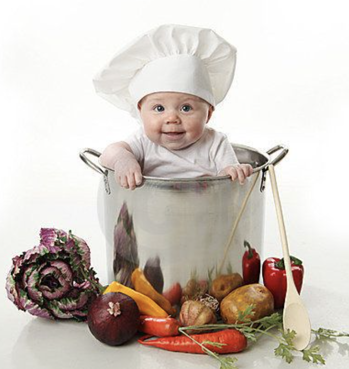

# cookbook

**cook·book**  */ˈko͝okˌbo͝ok/*

*Noun:*	
A book containing recipes and other information about the preparation and cooking of food.

*Synonyms:*	
cookery book



This is a collection of handy code snippets that can be used in various
projects. Each snippet is self-contained and can be easily integrated into a 
codebase. This cookbook is designed to save time and effort by providing
pre-written code that can be easily copied and pasted into any project.

## Developer Information

```bash
git clone https://github.com/swmcc/cookbook.git
```

Alternatively, you can download the repository as a ZIP file and extract it to
your local machine.

## Usage

The code snippets in this cookbook are organised into categories based on their
functionality or programming language. To find a snippet that suits your needs,
browse through the categories and select the one that matches your use case.
Most filenames are self explanatory but more complex recipies will contain a 
README file that explains how to use the code snippets.

## Contributions

Contributions are welcome! If you have a useful code snippet that you would
like to add to this cookbook, please follow these steps:

- Fork this repository.
- Create a new branch with a descriptive name `feature/new-snippet`.
- Add your code snippet to the appropriate category or create one , along with 
a README file explaining how to use it (if needed).
- Submit a pull request.
